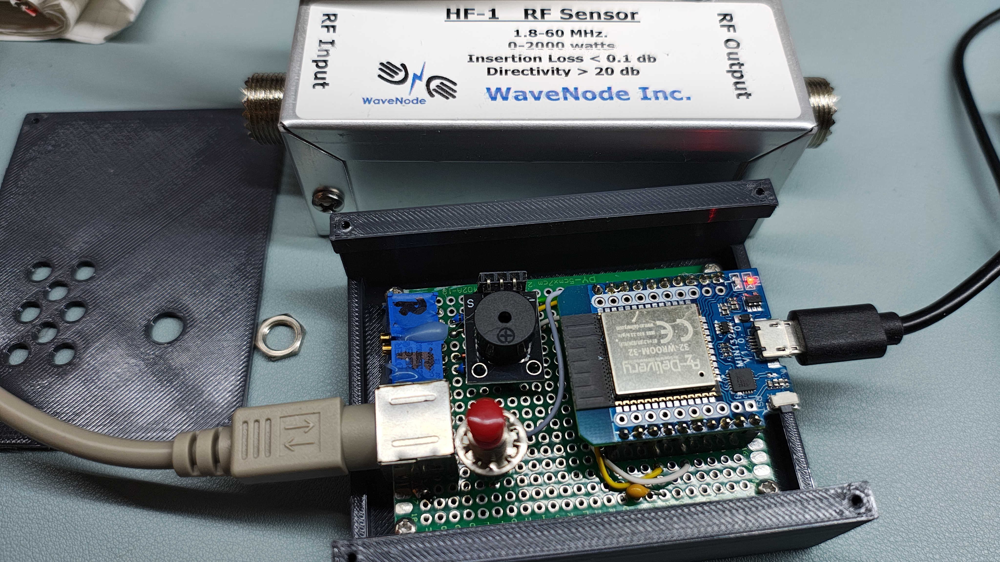

# SWR-Buzzer-LX1WJ

Dieses Projekt ist ein kleiner ESP32-Helfer zum Abstimmen einer Endstufe auf **maximale Leistung**.

Der Grundgedanke ist einfach:

- **hoeherer Ton** = mehr Leistung
- **tieferer Ton** = weniger Leistung

Der Anwender drueckt kurz auf den Taster, stimmt langsam ab und geht auf den **hoechsten Ton**.

Zusaetzlich ist eine `SWR`-Messung vorbereitet. Sie ist schon im Geraet vorhanden, soll aber vorerst nur nach Kalibrierung verwendet werden.

## Foto

## Anleitungen

- [Anleitung Bedienung](docs/ANLEITUNG_BEDIENUNG.md)
- [Anleitung Service](docs/ANLEITUNG_SERVICE.md)

## Lizenzhinweis

Dieses Projekt unterliegt meinen Lizenzbedingungen.

Bitte die jeweiligen Lizenzhinweise im Projekt beachten, bevor das Projekt genutzt, weitergegeben, geaendert oder veroeffentlicht wird.

## Haftungsausschluss

Die Nutzung dieses Projekts erfolgt auf eigene Verantwortung.

Es wird ohne Gewaehr bereitgestellt. Fuer Schaeden, Fehlfunktionen oder Folgeschaeden durch Aufbau, Verdrahtung, Einstellungen oder Nutzung wird keine Haftung uebernommen.

## Fuer den Anwender

Im normalen Betrieb ist nur wenig wichtig:

- **kurz druecken** = Leistungsmessung ein oder aus
- auf den **hoechsten Ton** abstimmen
- bei Bedarf mit dem Handy das WLAN `SWR-Buzzer-LX1WJ` oeffnen und `192.168.4.1` aufrufen

Auf der Webseite kann der Anwender die Leistungsmessung anpassen:

- `Startfrequenz`
- `Spannweite in Prozent`
- `Buzzer Lautstaerke`

Die einfache Bedienung steht in:

- `docs/ANLEITUNG_BEDIENUNG.md`

## Fuer Service und Abgleich

Technisch misst das Geraet `Forward` und `Reverse` direkt am ESP32 und stellt die Werte im eigenen WLAN-Access-Point dar.

Fuer Service und Abgleich wichtig:

- `GPIO34` = Forward
- `GPIO35` = Reverse
- an beiden ESP-Eingaengen nie mehr als `3.3 V`
- `Uf` und `Ur` werden im AP angezeigt
- fuer die SWR-Kalibrierung gibt es eine Tabelle mit `30` Zeilen

Die technische Beschreibung steht in:

- `docs/ANLEITUNG_SERVICE.md`

## Hardware

- `GPIO25` -> passiver Piezo
- `GPIO27` -> Taster nach `GND`
- `GPIO34` -> Forward-Messspannung
- `GPIO35` -> Reverse-Messspannung

## Spannungsteiler je Messkanal

- `100 kOhm` vom Sensor-Ausgang zum ESP32-Pin
- `33 kOhm` vom ESP32-Pin nach `GND`
- `3.3 V Zenerdiode` parallel zum `33 kOhm`

Wichtig:

- an `GPIO34` und `GPIO35` nie mehr als `3.3 V`
- `GND` von Bridge und ESP32 verbinden

## WLAN

- SSID: `SWR-Buzzer-LX1WJ`
- kein Passwort
- Webseite: `http://192.168.4.1`

## Webinterface

Angezeigt werden:

- Forward- und Reverse-Spannung am ESP32
- ADC-Rohwerte
- Referenzspannung
- aktuelle Tonfrequenz

Einstellbar sind:

- `Startfrequenz`
- `Spannweite in Prozent`
- `Buzzer Lautstaerke 1-10`
- `SWR Messung ein oder aus`
- `SWR Tonfrequenz`
- `Zeit fuer langen Tastendruck`
- `Kalibriertabelle mit 30 Zeilen`

## Taster

- kurzer Druck bei `Aus`: Leistungston ein und Forward-Referenz setzen
- kurzer Druck bei aktivem Ton: aus
- langer Druck bei `Aus`: SWR-Ton ein, aber nur wenn SWR im AP eingeschaltet wurde
- langer Druck bei aktivem Ton: aus

## SWR-Ton

- Default: `SWR` ist im AP erst einmal ausgeschaltet
- feste Tonfrequenz, nicht mehr SWR-abhaengig
- `SWR 1.00-1.99` -> `1x piepen`, Pause, wieder `1x`
- `SWR 2.00-2.99` -> `2x piepen`, Pause, wieder `2x`
- `SWR 3.00-3.99` -> `3x piepen`, Pause, wieder `3x`
- `SWR 4.00-4.99` -> `4x piepen`, Pause, wieder `4x`

## Dateien

- `src/SWR-Buzzer-LX1WJ.ino`
- `docs/ANLEITUNG_BEDIENUNG.md`
- `docs/ANLEITUNG_SERVICE.md`
- `images/image1.jpg`
